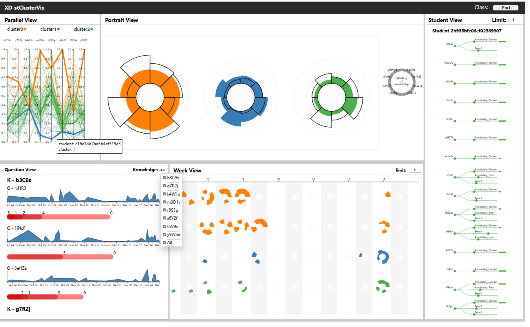

# data-visualization-lab

西电数据可视化课程实验代码
实验 1 为环境搭建故略去

文件夹树说明:
data-visualization-lab

├─lab2：实验 2 文件夹

│ ├─src:问题描述图片存储文件夹

│ │ ├─example.png

│ │ └─example2.png

│ ├─code.py：实验代码，可能不止一个

│ ├─data.csv：实验数据，可能不存在

│ ├─problem.md：实验问题描述

│ └─result.html：实验结果 html 文件，名字可能呢不一样

lab2：统计图数据可视化

lab3：空间数据可视化

lab4：地图数据可视化

lab5：高维非空间数据可视化/ChinaVis2022竞赛题目：交通

lab6：层次和网络可视化和文本可视化/ChinaVis2024竞赛题目I：培训机构

​			下图为完成的样式：

lab-additional：时序多变量数据可视化/ChinaVis2024竞赛题目II：数据分析公司