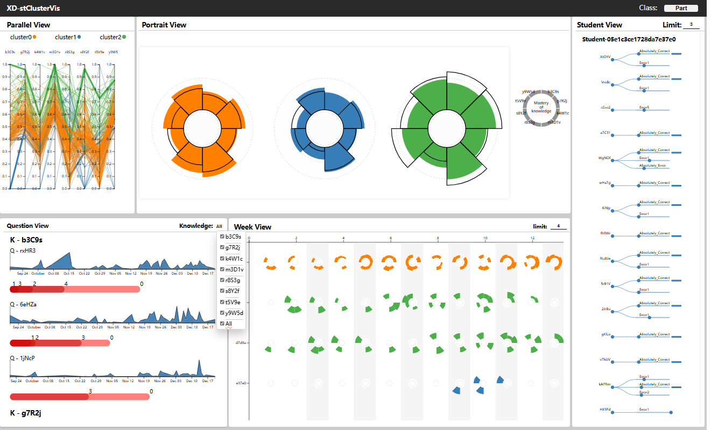

# data-visualization-lab

西电数据可视化2024秋季课程实验代码
实验 1 为环境搭建故略去

## Project structure

data-visualization-lab

├─==lab2/3/4：实验 2 文件夹==

│ ├─src:问题描述图片存储文件夹

│ │ ├─example.png

│ │ └─example2.png

│ ├─**code.py**：实验代码，可能不止一个，运行即可获得图像结果

│ ├─data.csv：实验数据，可能不存在

│ ├─problem.md：实验问题描述

│ └─**result.html**：实验结果 html 文件，名字可能呢不一样

├─==lab5/6/addition：实验 5 文件夹==

│ ├─src:问题描述图片存储文件夹

│ │ ├─example.png

│ │ └─example2.png

│ ├─data：实验数据文件夹，由于占据内存太大故不上传，自行在ChinaVis官网下载

│ ├─**backend**：flask后端代码文件夹

│ │ ├─model：数据库处理文件夹

│ │ ├─utils.py

│ │ ├─routes.py

│ │ └─**app.py**

│ ├─**frontend**：vue前端代码文件夹

│ │ ├─**dist**：生产环境打包文件夹

│ │ ├─public

│ │ ├─src

│ │ │├─api

│ │ │├─assets

│ │ │├─components

│ │ │├─store

│ │ │├─utils

│ │ │└─assets

│ │ ├─main.js

│ │ └─App.vue

│ └─problem.md：实验问题描述

## Description

lab2：统计图数据可视化

lab3：空间数据可视化

lab4：地图数据可视化

lab5：高维非空间数据可视化/ChinaVis2022竞赛题目：交通

​			下图为完成的样式：

lab6：层次和网络可视化和文本可视化/ChinaVis2024竞赛题目I：培训机构

​			下图为完成的样式：

​																				演示1

​																			 演示2

lab-additional：时序多变量数据可视化/ChinaVis2024竞赛题目II：数据分析公司

本题暂未完成

## Quick Start

### Clone Repository

### Running lab2/3/4

1. 转到相应项目文件夹下
2. 运行py代码
3. 打开生成的html

### Running lab5/6

1.  转到相应项目文件夹下
2.  运行后端
3.  运行前端