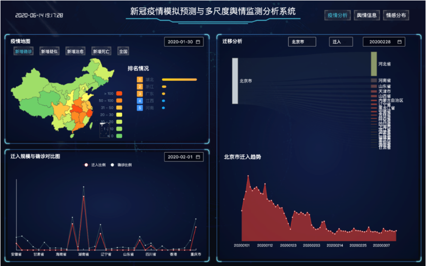

实验内容：

分析2020 新冠疫情。要求利用已有数据（CityData.xlsx）与已有工具，设计可视化方案，展示2020年全国新冠患者人数随时间的变化过程（右图仅供参考），并完成以下任务。

任务一：统计截止4月1日各省的累计确诊数量，并通过图表展示。

任务二：对每日各省的累计确诊患者数量进行统计，为图像添加时间轴，通过时间轴自动播放演示疫情发展的整个过程。

 

数据说明如下：

| CountryName | ProvinceName | cityName | city_confirmedCount | city_suspectedCount | city_curedCount | city_deadCount | updateTime |
| ----------- | ------------ | -------- | ------------------- | ------------------- | --------------- | -------------- | ---------- |
| 国家名称    | 省份名称     | 城市名称 | 累计确诊            | 疑似                | 治愈            | 死亡           | 更新日期   |

